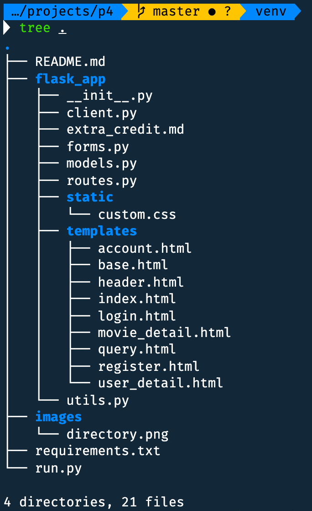

# P4: Movie Ratings Database

**Assigned**: Week 6, March 8th, 2020

**Due**: Week 10, April 4th, 2020, 11:59 PM

**Late Deadline**: Refer to syllabus for the policy.

## Description

You will be creating forms, view functions, and finishing templates for adding 
an account system to the project 3 app. For this website, users will have to 
be logged in in order to add comments. Also, we can see all the comments
made by each user by going to their user-detail page.

There will be two opportunities for extra credit: implementing
profile pictures for users and making the look and feel of the website better..

## Setup

The setup of the API key should be complete from project 3.

Create your `p4` virtual environment or use a common virtual environment
for the class, and activate it.
Then, to install the necessary packages, run `pip install -r requirements.txt`.

This week we'll be using the 
- `requests`
- `Flask`
- `Flask-MongoEngine`
- `Flask-WTF`
- `Flask-Bcrypt`
- `Flask-Login`
- `python-dotenv`
libraries

## Project

This is the `p4/` directory structure

To run this project, stay in the `p4/` directory and use the `flask run`
command. The file that is run is `run.py`. It simply imports the `app` object
from the `flask_app/` package. The reason we have this new structure is to
avoid the problem of circular imports in Python projects.

The initialization of the `app` object and the other libraries happens in 
`__init__.py`. All of the view functions are in `routes.py`. The
database models are in `models.py`, and the `MovieClient` class
is now in `client.py`. The `current_time()` function you used
in the last project is now in `utils.py`, and it's been imported
into `routes.py` for your convenience. Forms are still in `forms.py`.

There are 4 new template files, corresponding to four 4 view functions
in `routes.py`.
- `account.html`
- `login.html`
- `register.html`
- `user_detail.html`

Now we'll go into detail about each of the new view functions:
1. `account()` - Login required
   Should be routed at `/account`. Renders the `account.html` template.
   The template has spaces for a greeting to the user, a
   username update form, a profile picture update form, and a link
   to see all of the current user's reviews. The profile picture update
   form is optional, for extra credit.

   In the `account()` view function, make sure you create the username
   update form, and properly modify the current user's username permanently
   (commit change to database). 

   For the greeting, you can choose how to greet the current user. It should
   use the current user's username to greet them. (**Hint:** the current user
   object is available in every template). **Optionally**, if you are
   implementing the profile picture system, display the current user's 
   profile picture. The username update form
   should be rendered using Bootstrap classes. You can see an example of
   how we did that in `movie_detail.html`. For a link to all of the current
   user's reviews, you should redirect to the user detail page.
2. `login()`
   Should be routed at `/login`. Renders the `login.html` template.
   The template has spaces for adding a message to the user telling
   them to register (if they don't have an account), for displaying
   a login form, and for showing flashed messages (messages created with
   `flash()` function). 

   For the `login()` view function, redirect the user away from the page
   if they're already authenticated (they don't need to see the login page, then).
   Add the LoginForm and properly authenticate the user. If they're **not** 
   successfully authenticated, ask the user to login again (don't give them
   hints whether the username or password was wrong).
   If they are successfully authenticated, redirect to their `/account` page.

   In `login.html`, ask the user to register if they don't have an account
   (and provide the link for them to do so),
   and display flashed messages, the login form, and any login form errors
   rendered with Bootstrap classes. 
3. `register()`
   Should be routed at `/register`. Renders the `register.html` template.
   The template has spaces for asking the user to login if they already have
   an account, for showing the registration form, and for showing flashed
   messages.

   For the `register()` view function, redirect the user away from the page 
   if they're already authenticated. Add the RegistrationForm and create
   the new account for the user if the form is validated (make sure to
   store hashed passwords, not plaintext). If any errors occur with registration, 
   display the error message to the user.
   If successfully registered, redirect the user to the `/login` page.

   In `register.html`, ask the user to login if they already have an account, and
   provide the link for them to do so, display any messages you want flashed, 
   and display the registration form, all rendered with Bootstrap.
4. `user_detail(username)`
   Should be routed at `/user/<username>`. Renders the `user_detail.html` template.
   The template has a space for indicating whose reviews we're looking at, a 
   space for displaying all reviews, and a space for showing any errors.

   In the `user_detail()` view function, if the specified user exists, then
   render all of the reviews written by that user. If they don't exist, 
   display an error message. 

   In `user_detail.html`, indicate which user's reviews we're looking at. This
   is best done with their username. Then under that, display all of the reviews
   they've made. You should indicate how many reviews the specified user has made 
   in total, and then for each review show:
   - When the review was created
   - Which movie the review was made for (movie title)
   - The review content itself.
   - (Optionally) show the user's profile picture.
   Your template should be able to handle a variable number of reviews.
5. `logout()` - Login required
   Should be routed at `/logout`. Doesn't render a template, but
   logs out the current user. Redirect to the `/index` after
   logging out.
6. EXTRA CREDIT: `images()`
   Return an image. This can be used in conjunction with `url_for` in order
   to dynamically retrieve images.
   Refer to [this link](https://flask.palletsprojects.com/en/1.1.x/api/#flask.send_file).
   You can return `send_file()` from this view function, with the first argument
   being a [`BytesIO` object](https://docs.python.org/3/library/io.html#io.BytesIO)
   and the second argument setting `mimetype=image/png` or `mimetype=image/jpg`.
   The `BytesIO` object should be created with the image data.
7. EXTRA CREDIT: `movie_detail()`
   On the `movie_detail()` page, where users can enter reviews, show each commenter's
   profile picture next to their review.

Additionally, for each view function for which we indicated **Login required**,
use the `login_required()` decorator from `Flask-Login`.

In `forms.py`, we've included the code for the `RegistrationForm`
since we already discussed the implementation in class. We modified
the `MovieReviewForm` since users no longer have to enter their name;
it automatically gets added, since they're logged in when they're 
adding a review. You have to implement the `LoginForm`, `UpdateUsernameForm`, and
(optionally) `UpdateProfilePicForm`.
1. `LoginForm` - Should have username, password, and submit fields. For the
   password, use a `PasswordField`. Use validators that check
   that data has been entered, and create custom validator(s) if needed (examples
   can be seen in the slides for `wk3` and in `RegistrationForm`).
2. `UpdateUsernameForm` - Should have fields for username and submitting data. 
   The new username should *also* be between 1 and 40 characters long. If the
   username is taken, then warn the user, either by using a flashed message
   or a custom validator in the form itself. 
3. EXTRA CREDIT: `UpdateProfilePicForm` - Should have a `FileField` that only
   allows images, and a submit field. 

In `models.py`, you have to implement the `User` and `Review` 
document models. You also have to implement the user loader function, which
is used by `Flask-Login` in order to retrieve the current user object.
1. `User` - Should have these fields:
   - A required and unique **username** field, with minimum length 1 and maximum 
     length 40 characters.
   - A required and unique **email** field
   - A **password** field (only store slow-hashed passwords!)
   - (Optional) **profile_pic** `ImageField` (`ImageField` is a subclass of
     `FileField`, so you can use 
     [this link](http://docs.mongoengine.org/guide/gridfs.html) to learn how to
     store data and retrieve data)
   - (Optional) Any fields you'd like to add that you think will make your app
     easier to implement.
   You should also implement the `get_id()` method of `User`, which returns a 
   string unique to each user, so that `load_user(user_id)` works properly.
2. `Review` - Should have these fields:
   - A required reference to a `User`, who is the **commenter**
   - Required **content**, with minimum length 5 and maximum length 500 characters.
   - A required **date**, which can be saved as a string instead of a datetime
   - A required **imdb_id**, with length 9
   - (Optional) Any additional fields you'd like to add, if it will allow
     you to implement your app more easily.

## Extra Credit

There are two opportunities for extra credit:
1. Implement the profile picture system successfully; this involves saving and
   retrieving images with the `images` view function, and showing profile
   pictures for users (if they have one) whenever you're showing reviews.
2. You can improve the layout and look and feel of the website by editing any
   the templates or the `custom.css` file. You can also try improving the
   accessibility of the website. If you believe you should receive extra credit
   for your visual additions, edit `extra_credit.md` and describe
   what additions you made, and why it warrants extra credit.

We'll give up to 20% extra credit for each opportunity, so there's a total 
opportunity for 40% extra credit.

## Testing

When your current directory is `p4/`, you can run the command `flask run`
in your terminal or command line to see your website.

We've listed all the requirements above, in high detail. Make sure you fill
out all of those requirements, and that you display errors relevant to each
page properly, and that the `current_user` object is used where needed.

*We will be* releasing a demo video within the next couple of days.

## Submissions

Assure that you've tried out all the different things that could go wrong and that they
are behaving appropriately (and the things that are supposed to work, still do), and
errors are shown when they are supposed to be shown.

For submission, submit the zipped `flask_app/` directory.
**The directory, along with its contents, should be zipped, not the contents of the directory.**
In other words, when we unzip your file, we should see the `flask_app/` directory. If you
have any questions on how to submit, please contact us.

If you don't submit according to the instructions above, you may lose **up to 25%** of your
score on this project.

After zipping, submit the zip file to the appropriate ELMS page. No test results will be shown.
